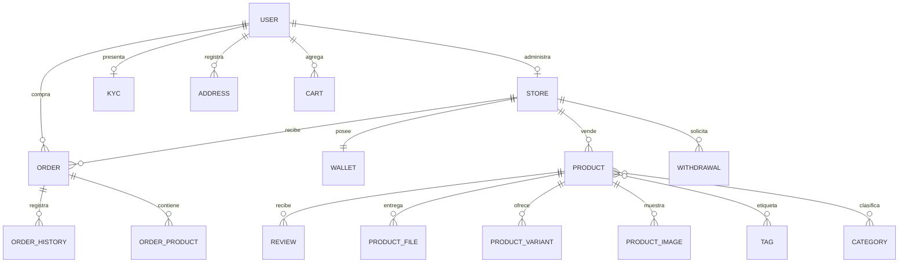

# Datos y relaciones

Este diagrama resume las relaciones que gobiernan el marketplace; no sustituye las migraciones.

## Entidades principales

- **User:** cliente y, cuando corresponde, propietario de una tienda.
- **Admin:** identidad separada para backoffice; recibe roles y permisos.
- **Store:** vendedor visible, con catálogo, pedidos, reseñas y cartera.
- **Product:** físico o digital; concentra precio, stock, variantes, archivos y relaciones de catálogo.
- **Order:** pedido perteneciente a un cliente y una tienda.
- **Wallet:** saldo contable de una tienda.
- **Withdrawal:** solicitud de retiro hacia un método configurado.

## Estados como contrato

Los valores de estado se usan entre controladores, vistas y consultas. Antes de agregar o renombrar un estado busca todas sus referencias y crea una migración si afecta datos existentes. Es recomendable evolucionarlos hacia enums PHP y pruebas de transición.

## Integridad

La lógica actual contiene operaciones financieras que abarcan múltiples escrituras. Deben ejecutarse dentro de transacciones y con llaves de idempotencia antes de escalar a producción. Las restricciones únicas y foráneas deben permanecer alineadas con los modelos.
