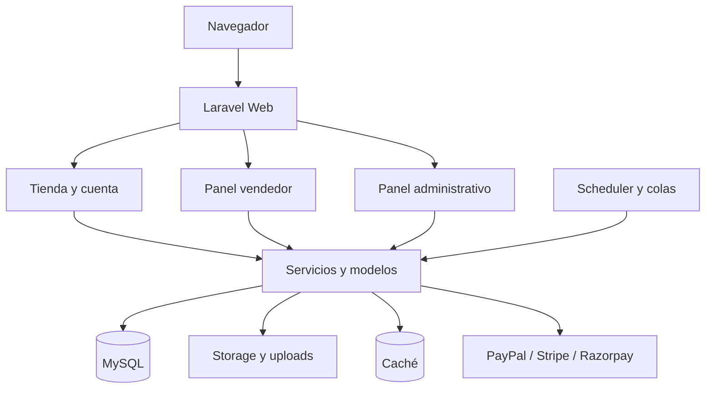
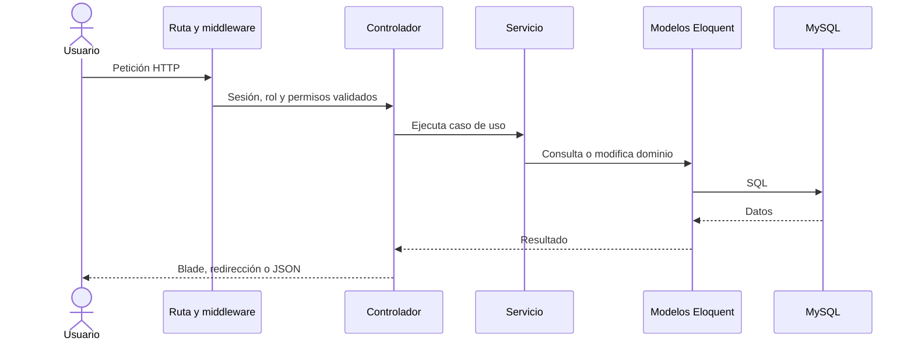

# Visión general

Plazora es un monolito modular Laravel: comparte despliegue y base de datos, pero separa responsabilidades mediante rutas, controladores, modelos, servicios y vistas.

## Límites de acceso

- Las rutas públicas permiten explorar catálogo y contenido.
- Las acciones de cuenta requieren sesión y, según el caso, correo verificado.
- El panel vendedor requiere rol `vendor`; operaciones sensibles además requieren KYC aprobado.
- El panel administrativo usa el guard `admin` y permisos de Spatie.

## Flujo de una petición

## Principios para extender el sistema

1. Mantén reglas que cruzan varios modelos dentro de servicios y transacciones.
2. Autoriza por recurso, no sólo por prefijo de ruta.
3. Trata callbacks de pago y retiros como operaciones idempotentes.
4. No expongas documentos privados mediante rutas públicas de archivos.
5. Documenta toda nueva variable, permiso, estado o tarea programada.
