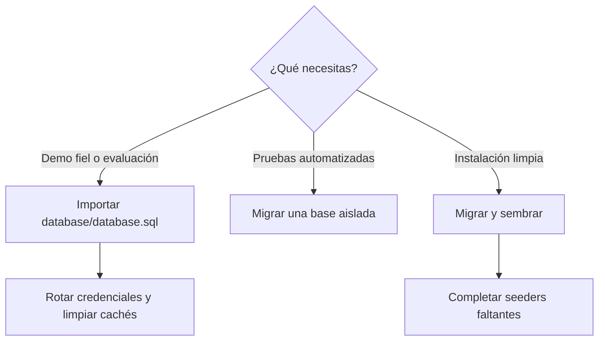

# ADR-001: `database.sql` frente a seeders

- **Estado:** aceptada para la distribución actual
- **Decisión:** usar `database/database.sql` para reproducir la demostración; reservar migraciones y seeders para desarrollo limpio y pruebas.

## Contexto

El snapshot SQL contiene un conjunto coherente de catálogo, tiendas, contenido, ajustes y referencias de archivos. `DatabaseSeeder` ejecuta únicamente un subconjunto de seeders y no reconstruye la misma experiencia.

Algunos seeders de demostración dependen de identificadores preexistentes, usan valores rígidos o pueden generar slugs y SKU repetidos. Ejecutarlos después del snapshot también puede provocar colisiones.

## Decisión

## Consecuencias

### Positivas

- La demostración se levanta con contenido y relaciones congruentes.
- Se reduce el tiempo para evaluación funcional.
- Los tests pueden seguir usando un estado efímero por migraciones.

### Costos y riesgos

- El SQL es una fotografía y puede divergir de futuras migraciones.
- Puede contener caché, referencias de archivos y datos de demostración obsoletos.
- No es adecuado como estrategia repetible para múltiples instalaciones sin sanitización.

## Procedimiento

Para una demo nueva: crea `plazora`, importa el SQL, restaura los archivos asociados, rota todas las credenciales, revisa ajustes y ejecuta `php artisan optimize:clear`.

No ejecutes seeders encima del snapshot. En releases posteriores usa migraciones incrementales.

## Camino de mejora

1. Crear factories deterministas para usuarios, tiendas y catálogo.
2. Eliminar dependencias de IDs rígidos.
3. Hacer los seeders idempotentes o documentar que sólo operan en base vacía.
4. Añadir un seeder explícito de demo y otro mínimo de producción.
5. Probar que `migrate:fresh --seed` produce un sistema utilizable.
6. Generar snapshots sanitizados desde ese flujo y retirar el SQL manual cuando exista paridad.
