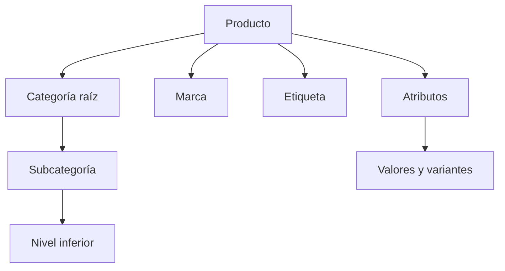

# Catálogo

## Producto

`Product` pertenece a una tienda y admite dos naturalezas:

- **Físico:** requiere stock, logística y, opcionalmente, variantes.
- **Digital:** puede asociar archivos que el comprador obtiene después de una compra válida.

Se relaciona con categorías, etiquetas, atributos, valores, imágenes, variantes, archivos y reseñas.

## Taxonomía

Las categorías forman un árbol padre-hijo. La interfaz y las consultas deben respetar la profundidad admitida por la implementación. Marcas y etiquetas ofrecen dimensiones adicionales sin alterar la jerarquía.

## Precio y disponibilidad

El precio mostrado puede depender del precio base, oferta y variante elegida. El stock debe validarse nuevamente en servidor al añadir al carrito y al crear el pedido; nunca confíes sólo en la interfaz.

## Ciclo editorial

Un vendedor crea y mantiene el producto. El panel administrativo conserva capacidad de gobierno y moderación. Los cambios en slug deben considerar enlaces indexados y redirecciones.

## SEO de catálogo

- Títulos y descripciones únicos y descriptivos.
- Imágenes con texto alternativo útil y dimensiones conocidas.
- Canonical consistente y datos estructurados cuando corresponda.
- No indexar combinaciones de filtros que produzcan contenido duplicado.
- Conservar slugs estables o responder con redirección permanente.
