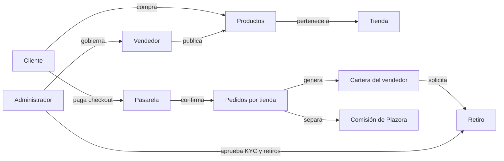

# Modelo del marketplace

Plazora conecta clientes con múltiples tiendas y mantiene el control central de catálogo, comisiones, pagos y retiros.

## Propuesta de valor

- El cliente compra productos de varias tiendas desde un mismo escaparate.
- Cada vendedor controla su catálogo y procesa los pedidos de su tienda.
- Plazora define reglas globales, cobra comisión y modera la operación.

## Agregados funcionales

| Área | Responsabilidad |
| --- | --- |
| Identidad | Registro, autenticación, verificación y perfiles |
| Catálogo | Productos, taxonomía, variantes, stock, media y archivos |
| Conversión | Carrito, deseos, cupón, envío y checkout |
| Cumplimiento | Pedidos, historial, estados, descargas y reseñas |
| Marketplace | Tiendas, KYC, comisión, cartera y retiros |
| Gobierno | Roles, permisos, ajustes, contenido y moderación |

## Reglas transversales

- Un producto vendible pertenece a una tienda.
- Un carrito con varias tiendas se convierte en un pedido por tienda.
- Los productos digitales pueden adjuntar archivos descargables.
- La aprobación KYC habilita operaciones protegidas del vendedor.
- El porcentaje de comisión administrativa procede de los ajustes globales.
- Los retiros dependen de saldo y límites configurados.
