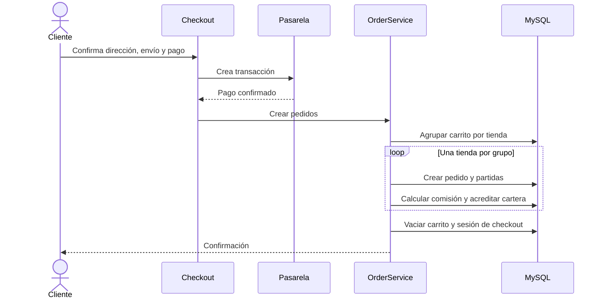

# Pedidos y pagos

## Conversión del carrito

El checkout agrupa los artículos por tienda. `OrderService` crea un pedido para cada grupo y guarda instantáneas de direcciones, productos, precios y logística para que el historial no dependa de cambios futuros del catálogo.

## Pasarelas

La aplicación integra PayPal, Stripe Checkout y Razorpay. Sus claves y modo sandbox/producción se administran en ajustes. Cada proveedor tiene flujo de éxito y cancelación propio.

## Comisión y cartera

Al crear el pedido, la implementación calcula la comisión global configurada y acredita a la cartera de la tienda el total menos esa comisión.

::: danger Endurecimiento obligatorio
La creación de pedidos, partidas y movimientos financieros debe estar dentro de una transacción de base de datos. Los callbacks deben ser idempotentes y verificar en servidor monto, moneda, estado y referencia del proveedor. Sin ello, un callback repetido puede duplicar pedidos o saldos.
:::

## Riesgo detectado en carritos multitienda

La implementación actual merece una prueba específica para confirmar que descuentos, envío, total pagado y comisión se prorratean correctamente entre pedidos. No asumas que el total global puede asignarse a cada tienda.

## Casos que deben tener pruebas

- Pago aprobado, cancelado, rechazado y callback repetido.
- Carrito con una y varias tiendas.
- Cupón global o restringido y costos de envío distintos.
- Variante agotada entre carrito y pago.
- Producto digital y permisos de descarga.
- Reembolso, cancelación y reverso de cartera.
