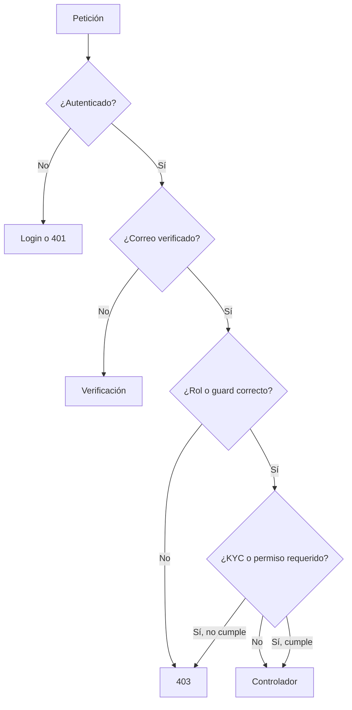

# Usuarios y permisos

## Actores

### Visitante

Explora catálogo, tiendas, páginas y promociones. Debe autenticarse para acciones personales como carrito persistente, wishlist o checkout.

### Cliente

Gestiona perfil y direcciones, compra, consulta pedidos, descarga productos digitales y publica reseñas según las reglas del sistema.

### Vendedor

Es un usuario con rol `vendor` y una tienda asociada. Gestiona catálogo, pedidos, métodos de retiro y solicitudes. Ciertas rutas exigen correo verificado y KYC aprobado.

### Administrador

Usa el guard `admin`. Sus capacidades se asignan con roles y permisos de Spatie, separados de los roles de clientes y vendedores.

## Capas de autorización

## Permisos administrativos sembrados

El seeder define permisos para KYC, roles, usuarios de rol, categorías, etiquetas, marcas, productos, pedidos, ecommerce, secciones, suscriptores, retiros, páginas, anuncios, contactos, pagos y ajustes. El rol inicial de superadministración recibe el conjunto completo.

## Buenas prácticas

- Comprueba propiedad del recurso además del rol: un vendedor sólo debe modificar su tienda y productos.
- Usa políticas de Laravel para reglas por modelo.
- Mantén el guard correcto al crear roles o permisos.
- Audita cambios sensibles y accesos a documentos KYC.
- No documentes ni publiques contraseñas creadas por seeders; rótalas al instalar.

La entrega local constituye una excepción controlada: sus [cuentas demo](/guia/cuentas-demo) son públicas, están identificadas como no productivas y deben eliminarse o rotarse antes del despliegue.
