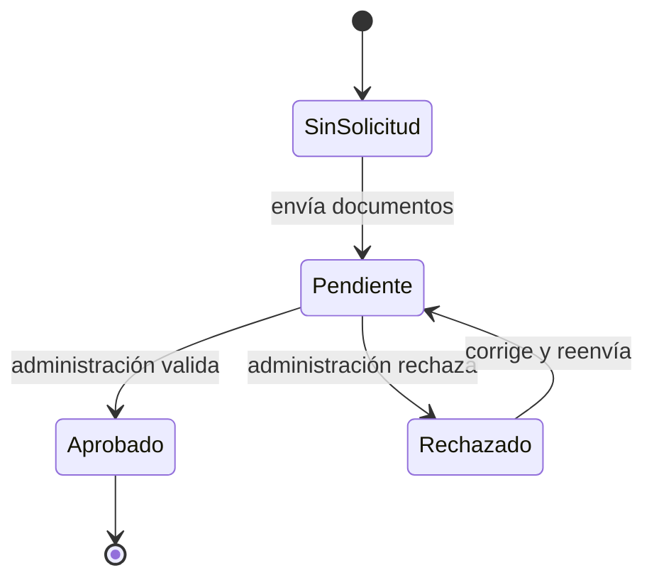
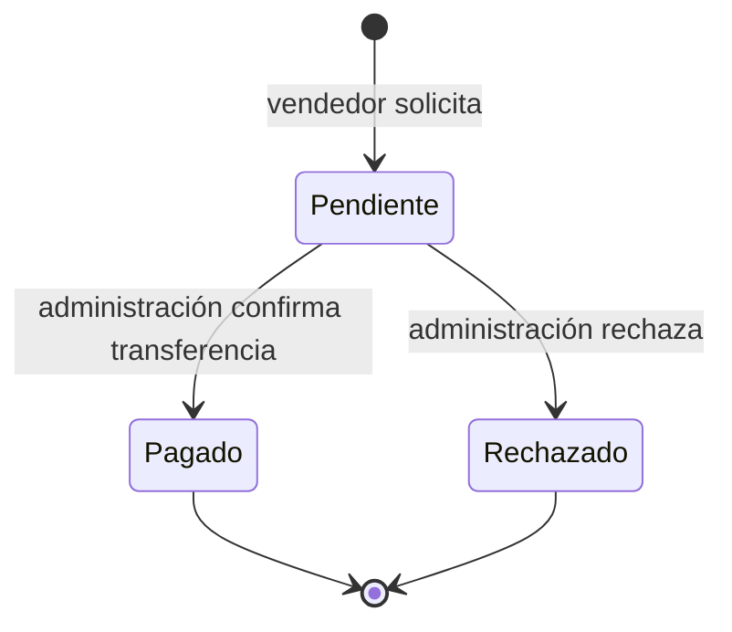

# Vendedores, KYC y retiros

## Incorporación del vendedor

Un vendedor es un usuario con rol específico y una tienda. Antes de habilitar operaciones sensibles puede requerirse verificación de identidad o negocio.

Los documentos KYC se guardan en almacenamiento privado. La descarga debe pasar por autenticación, autorización y registro de acceso; nunca expongas la ruta física.

## Cartera

Cada tienda tiene una cartera. El saldo disponible proviene de ventas menos comisión, sujeto a los estados y políticas del negocio. Para contabilidad robusta conviene usar un libro de movimientos inmutable en lugar de depender únicamente de un saldo mutable.

## Retiros

El vendedor configura un método, solicita una cantidad dentro de los límites y espera revisión. La implementación evita más de una solicitud pendiente. Al marcar una solicitud como pagada, el saldo se descuenta.

::: warning Riesgo operativo
La transición a pagado debe ser atómica e idempotente. Verifica estado previo y saldo dentro de una transacción con bloqueo; una actualización repetida no debe descontar dos veces.
:::

## Política recomendada

Define por escrito retenciones, plazo de liberación, importe mínimo/máximo, moneda, comisiones, evidencia bancaria, cancelaciones, contracargos y proceso de conciliación.
