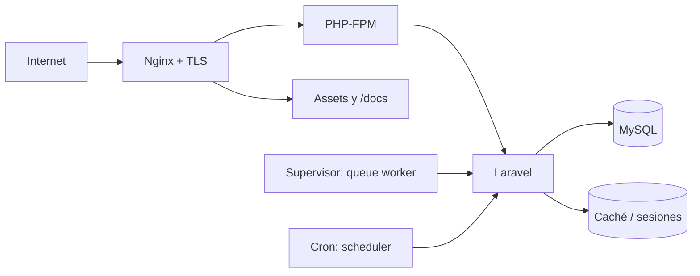

# Despliegue en VPS

La plataforma está diseñada y documentada para desplegarse en una **VPS con Ubuntu Server administrada por el propietario**, usando Nginx, PHP 8.5 mediante PHP-FPM, MySQL y TLS. Éste es el entorno de producción recomendado y el que debe tomarse como referencia para soporte y operación.

Una VPS permite controlar versiones, extensiones PHP, procesos de cola, cron, límites de Nginx, certificados, backups y observabilidad. Plazora no plantea el hosting compartido como destino principal porque normalmente restringe precisamente esas capacidades. Consulta la [comparativa de infraestructura](/operacion/vps-vs-hosting-compartido).

::: tip Principio de despliegue
El objetivo no es solamente lograr que la aplicación responda: es poder actualizarla, supervisarla, respaldarla y recuperarla de forma predecible. Por eso la guía prioriza una VPS bajo tu control.
:::

## Componentes



## Preparar el servidor

Instala PHP 8.5 con las extensiones requeridas, Composer, MySQL, Nginx y Node.js sólo si compilarás en la VPS. Plazora no soporta versiones menores de PHP. Para menor superficie, compila assets en CI y entrega artefactos.

El administrador de la VPS es responsable de actualizaciones del sistema operativo, firewall, usuarios SSH, fail2ban o controles equivalentes, TLS, monitoreo y respaldos. Evita operar todos los servicios como `root`; utiliza cuentas y permisos específicos.

El propietario del proceso web necesita escritura únicamente en `storage`, `bootstrap/cache` y las rutas de uploads definidas. No concedas escritura global al repositorio.

## Secuencia de release

```bash
composer install --no-dev --classmap-authoritative --no-interaction
npm ci
npm run build
php artisan migrate --force
php artisan storage:link
php artisan optimize:clear
php artisan optimize
php artisan queue:restart
```

Si la instalación inicial depende de `database.sql`, impórtalo una sola vez antes de atender tráfico; los siguientes releases deben avanzar mediante migraciones.

## Nginx de referencia

```nginx
server {
    listen 443 ssl http2;
    server_name ejemplo.com;
    root /var/www/plazora/current/public;
    index index.php;

    location /docs/ {
        try_files $uri $uri/ $uri.html =404;
    }

    location / {
        try_files $uri $uri/ /index.php?$query_string;
    }

    location ~ \.php$ {
        include fastcgi_params;
        fastcgi_param SCRIPT_FILENAME $document_root$fastcgi_script_name;
        fastcgi_pass unix:/run/php/php8.5-fpm.sock;
    }

    location ~ /\.(?!well-known).* { deny all; }
}
```

Ajusta el socket a la versión realmente instalada. Agrega certificados administrados, límites de subida, headers de seguridad y compresión desde la configuración central de infraestructura.

## Variables de producción

```dotenv
APP_ENV=production
APP_DEBUG=false
APP_URL=https://ejemplo.com
LOG_LEVEL=warning
SESSION_SECURE_COOKIE=true
```

Usa credenciales separadas por entorno, HTTPS obligatorio y callbacks de pago con URLs públicas exactas.

## Despliegue sin interrupción

Utiliza releases versionados y un enlace `current`; comparte `.env`, uploads y storage persistente. Ejecuta migraciones compatibles hacia adelante antes de cambiar el enlace y conserva al menos un release para rollback. Una reversión de código no siempre puede revertir datos.
