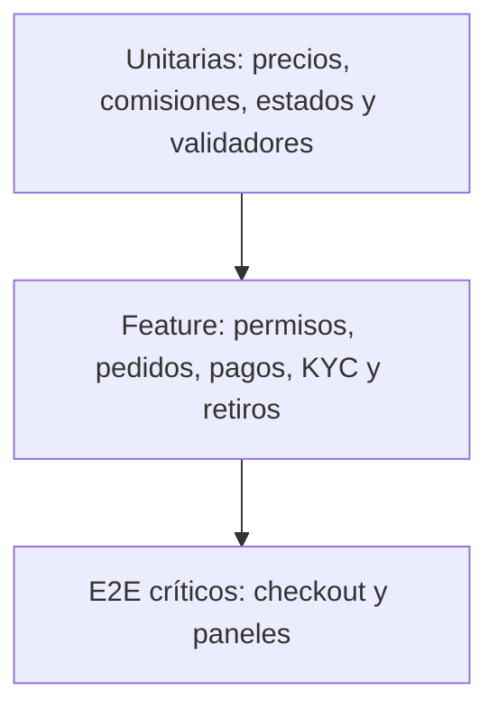

# Pruebas y calidad

El repositorio usa Pest y conserva principalmente pruebas base de autenticación y perfil. La cobertura de negocio del marketplace debe ampliarse antes de confiar en automatización para releases financieros.

::: warning Línea base actual
Al mapear el proyecto, 18 pruebas pasan y 7 pruebas heredadas de Breeze fallan porque esperan endpoints y comportamiento de perfil/registro que la aplicación personalizada ya sustituyó. No son fallos introducidos por la documentación, pero deben actualizarse antes de exigir una suite completamente verde.
:::

## Ejecutar

```bash
php artisan test
php artisan test --filter=AuthenticationTest
npm run build
npm run build
```

Usa una base separada, por ejemplo `plazora_testing`. Nunca apuntes las pruebas a `plazora` con datos reales o de demostración.

## Pirámide recomendada



## Prioridades

1. Aislamiento de vendedores y permisos administrativos.
2. Carrito multitienda y cálculo por tienda.
3. Callbacks idempotentes para cada pasarela.
4. Comisión, cartera, retiro y transiciones repetidas.
5. Stock concurrente y productos digitales.
6. Importación/migración y seeders reproducibles.
7. Accesibilidad de navegación, formularios y errores.

## Criterio de entrega

- Tests verdes y sin advertencias nuevas.
- `php artisan optimize` exitoso.
- Builds de aplicación y documentación exitosos.
- Smoke test con cachés activas.
- Revisión responsive, teclado, contraste y ambos temas.
- Sin secretos o credenciales de demostración expuestos.
